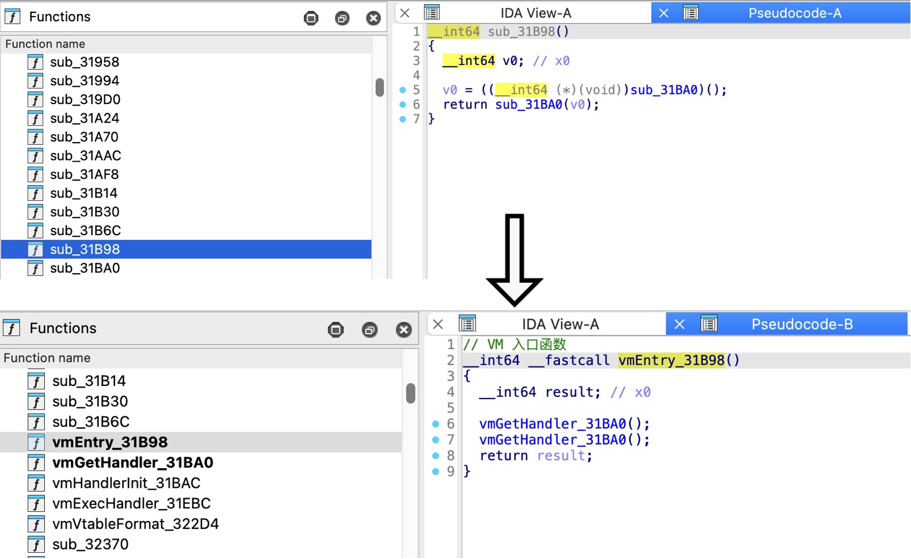

# idaRenameSymbol

最后更新：`20260223`

IDA插件：根据配置文件 `config.json` 批量重命名IDA中的符号（函数、数据），并添加注释。

## 效果



## 功能

- **函数重命名**：如 `sub_2CC50` -> `vmObjRefCleanup_2CC50`，并添加函数注释（IDA伪代码视图顶部显示）
- **数据重命名**：如 `qword_1C10D0` -> `g_globalContext_1C10D0`，并添加可重复注释（IDA汇编视图右侧显示）
- **类型自动检测**：若 `config.json` 中未指定 `type`，插件会自动判断是函数还是数据
- **幂等运行**：重复运行时自动检测已重命名的符号并跳过，仍会更新注释
- **结果导出**：可选导出重命名结果到 JSON 文件

## 使用方法

1. 复制 `config.example.json` 为 `config.json`，填入你的符号列表
2. 将 `config.json` 放在与 `idaRenameSymbol.py` 同目录，或IDA当前二进制文件所在目录
3. IDA Pro -> File -> Script file... -> 选择运行 `idaRenameSymbol.py`

## config.json 格式

```json
{
  "isExportResult": true,
  "symbolList": [
    {
      "oldName": "sub_2CC50",
      "newName": "vmObjRefCleanup_2CC50",
      "type": "function",
      "comment": "功能: ObjRef清理包装器\n描述: 简单的包装函数"
    },
    {
      "oldName": "qword_1C10D0",
      "newName": "g_globalContext_1C10D0",
      "type": "data",
      "comment": "全局上下文指针，10016字节"
    }
  ]
}
```

### 字段说明

| 字段 | 必填 | 说明 |
|------|------|------|
| `isExportResult` | 否 | 是否导出重命名结果到JSON文件，默认 `true` |
| `oldName` | 是 | IDA中当前的符号名称 |
| `newName` | 是 | 要重命名为的新名称 |
| `type` | 否 | `"function"` 或 `"data"`，不填则自动检测 |
| `comment` | 否 | 要添加的注释内容，支持 `\n` 换行 |

### 注释效果

- **function**：通过 `set_func_cmt` 设置，在IDA伪代码视图中函数顶部显示
- **data**：通过 `set_cmt(repeatable=True)` 设置，在IDA汇编视图中地址右侧显示

### 重复运行

脚本支持幂等运行。当 `oldName` 在IDA中已找不到时，会自动尝试用 `newName` 查找：

| 场景 | 结果 |
|------|------|
| 首次运行（`oldName` 存在） | **OK**：重命名 + 设置注释 |
| 重复运行（已改名，`newName` 存在） | **Skipped**：跳过重命名，更新注释 |
| `oldName` 和 `newName` 都不存在 | **Fail**：报错 |
